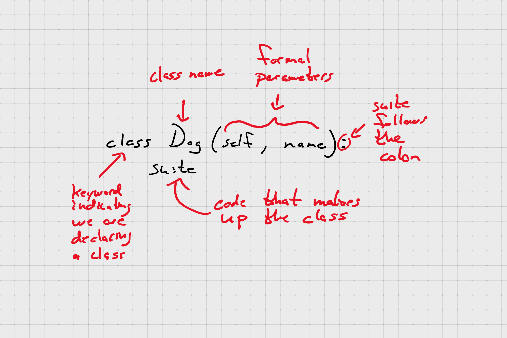

# Introduction to Classes

## Object-Oriented Programming (OOP)

OOP is a programming paradigm that emphasizes designing your code so that it models real-word things.

- Objects: the _nouns_ in our program; the things we are modeling
- Methods: the _verbs_ that describe what our objects can do
- Attributes: the properties (think _adjectives_) that our objects have; ex. shirts have color, dogs eye color, etc

Objects communicate by passing messages to each other

**Python is inherently an object-oriented language**

### Three Pillars of Object-Oriented Programming

- Encapsulation
- Inheritance
- Polymorphism

## Class and Instance

- **Class:** serves as a template for creating objects

- **Instance:** an in-memory _thing_ that was created using the class template

_Example:_ a class is to an instance as a blueprint is to a house; cookie cutter

## Built-In Classes

Python ships with _many_ built-in types all of which are themselves instances of classes

Your classes are on equal footing with them

## A Little Terminology



## Class and Instance Attributes

```python
class Dog:
    def __init__(self, name):
        self._name = name

good_boi = Dog("Morgan")
good_girl = Dog("Sam")

Dog.class_attribute = "mammal"  # add an attribute to ALL instances of Dog

dir(good_boi)  # class_attribute is part of good_boi automatically
dir(good_girl)  # class_attribute is part of good_girl automatically

good_girl.instance_attribute = "Best dog ever"

dir(good_girl)  # we see that instance_attribute can be found on good_girl
dir(good_boi)  # we see that instance_attribute is not found on good_boi

good_girl.instance_attribute = "Really, she was the best"
```

## `isinstance`

`isinstance(object, type)` returns a Boolean indicating whether `object` is of type `type`

## Object Methods

How to declare and use methods on an object

A method is simply a function that belongs to a class. This means they can access class data directly.

```python
class Dog:
    def __init__(self, name):
        self._name = name

    def speak(self):
        print("Woof!!")

    def get_name(self):
        return self.

    def set_name(self, new_name):
        self._name = new_name
```

Dunder methods are specials methods that Python will call directly under certain circumstances; ex. `__init__` gets called when we make a new instance of a class.

These make up what known as the **Python data model.**
