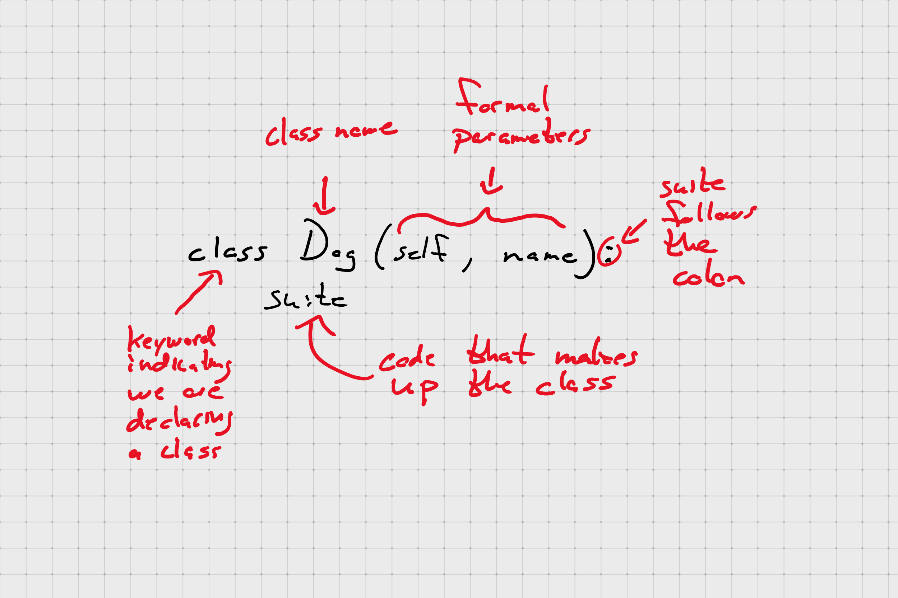

# Introduction to Classes

## Object-Oriented Programming (OOP)

OOP is a programming paradigm that emphasizes designing your code so that it models real-word things.

- Objects: the _nouns_ in our program; the things we are modeling
- Methods: the _verbs_ that describe what our objects can do
- Attributes: the properties (think _adjectives_) that our objects have; ex. shirts have color, dogs eye color, etc

Objects communicate by passing messages to each other

**Python is inherently an object-oriented language**

### Three Pillars of Object-Oriented Programming

- Encapsulation
- Inheritance
- Polymorphism

## Class and Instance

- **Class:** serves as a template for creating objects

- **Instance:** an in-memory _thing_ that was created using the class template

_Example:_ a class is to an instance as a blueprint is to a house; cookie cutter

### Built-In Classes

Python ships with _many_ built-in types all of which are themselves instances of classes

Your classes are on equal footing with them

#### A Little Terminology



### Class and Instance Attributes

```python
class Dog:
    def __init__(self, name):
        self._name = name

good_boi = Dog("Morgan")
good_girl = Dog("Sam")

Dog.class_attribute = "mammal"  # add an attribute to ALL instances of Dog

dir(good_boi)  # class_attribute is part of good_boi automatically
dir(good_girl)  # class_attribute is part of good_girl automatically

good_girl.instance_attribute = "Best dog ever"

dir(good_girl)  # we see that instance_attribute can be found on good_girl
dir(good_boi)  # we see that instance_attribute is not found on good_boi

good_girl.instance_attribute = "Really, she was the best"
```

#### `isinstance`

`isinstance(object, type)` returns a Boolean indicating whether `object` is of type `type`

## Object Methods

How to declare and use methods on an object

A method is simply a function that belongs to a class. This means they can access class data directly.

```python
class Dog:
    def __init__(self, name):
        self._name = name

    def speak(self):
        print("Woof!!")

    def get_name(self):
        return self.

    def set_name(self, new_name):
        self._name = new_name
```

Dunder methods are specials methods that Python will call directly under certain circumstances; ex. `__init__` gets called when we make a new instance of a class.

These make up what known as the **Python data model.**

### The Special Argument `self`

Note that every method has as its first parameter `self`. `self` is an argument that Python automatically passes to each method of a class and is _always a reference to the object that called the method._

### Methods Are the Interface to a Class Instance

They allow us to abstract away implementation details, define how a user interacts with an instance of the class, and enforce rules about how the class can be used.

### Python Properties vs Getters and Setters

So far we've only dealt with properties &ndash; state data stored inside an object instance. Access to the properties of an opbject cannot be controlled in Python without taking special steps &ndash; there is no "private" in Python. This violates encapsulation.

#### Getters and Setters to the Rescue

- __Getters:__ These are the methods used in OOPS which helps to access the private attributes from a class.

- __Setters:__ These are the methods used in OOPS feature which helps to set the value to private attributes in a class.

### An Improved `Point` class

First, indicate that the class' data is private by using double leading underscores (this triggers name mangling).

```python
def __init__(self, x=0.0, y=0.0):
    """
    Initialize an instance of Point.

    Keyword Arguments:
        x {float} -- The x-coordinate of the point (default: {0})
        y {float} -- The y-coordinate of the point (default: {0})
    """
    self.__x = x
    self.__y = y
```

```python
>>> p = point.Point()
>>> dir(p)
['__add__', '__class__', '__delattr__', '__dict__', '__dir__', '__doc__', '__eq__', '__format__', '__ge__', '__getattribute__', '__gt__', '__hash__', '__init__', '__init_subclass__', '__le__', '__lt__', '__module__', '__ne__', '__new__', '__reduce__', '__reduce_ex__', '__repr__', '__setattr__', '__sizeof__', '__str__', '__subclasshook__', '__weakref__', '_x', '_y', 'add', 'euclidian_distance', 'manhattan_distance']
```

```python
>>> p2 = point_2.Point()
>>> dir(p2)
['_Point__x', '_Point__y', '__add__', '__class__', '__delattr__', '__dict__', '__dir__', '__doc__', '__eq__', '__format__', '__ge__', '__getattribute__', '__gt__', '__hash__', '__init__', '__init_subclass__', '__le__', '__lt__', '__module__', '__ne__', '__new__', '__reduce__', '__reduce_ex__', '__repr__', '__setattr__', '__sizeof__', '__str__', '__subclasshook__', '__weakref__', 'add', 'euclidian_distance', 'manhattan_distance']
```

Next, using decorators, define methods for accessing and retrieving property values. The real benefit here is you are able to use code to ensure that the data set in the property is valid.

```python
@property
def x(self):
    """Access the x-coordinate of the point.

    Returns:
        float -- The x-coordinate of the point.

    """
    return self.__x

@x.setter
def x(self, new_value):
    """Set the x-coordinate.

    Valid x-coordinates must be either of type int or type float.

    Arguments:
        new_value {int or float} -- The new x-coordinate of the
        point.

    """
    if isinstance(new_value, (int, float)):
        self.__x = new_value
    else:
        pass
        # this would be a good time to raise an exception
```

__Note:__ A similar set of getters/setters was written for `Point`'s `y' value as well.

With these in place, all access to the object's private data is routed through the appropriate method.

```python
>>> p2 = point_2.Point()
>>> p2
point.Point(0.000000, 0.000000)
>>> p2.x=3
>>> p2.y=4.3
>>> p2
point.Point(3.000000, 4.300000)
>>> p2.y="two"
>>> p2
point.Point(3.000000, 4.300000)
```

### Are Getters and Setters Pythonic?

🤷‍♂ 🤷‍♀

Python does have a guiding philosophy that states, "We are all adults here." If the designer of a class indicates something should be private, the a programmer violates that privacy at their own risk.

On the other hand, getters and setters are a pattern that is widely used in languages that do support "proper" encapsulation meaning the interface for using properties on an object will be familiar to programmers used to writing in those languages.
