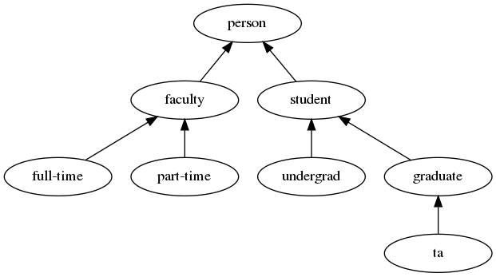

# More on Classes

Object-Oriented Programming (OOP) not only helps you create and organize new data structures, but also affects how you think about problem solving.

## More About Class Properties

As previously mentioned, there are three main OOP characteristics: encapsulation, inheritance, and polymorphism.

In our discussion of encapsulation we have focused on its ability to:

- __Hide details__ of implementation to aid reading and understanding of code.
- Provides __modularity__ that makes it easier to use a class in other contexts.
- Provides an __interface__ in the form of methods to access and manipulate a class instance.

To this, let's add _consistency_:

- A new class should be consistent with the rules and syntax of the language.
- A new class should respond to "standard methods" (such as construction, printing, and iteration) that are appropriate for the class.

### Rational Number (Fraction) Class Example

`rational_v1.py`

## How Does Python Know?

How does Python "know" what operators and methods a new class provides?

- Python can distinguish operators and methods based on the the _type_ of the objects being used.
- Python provides some special method names that represent typical operators in the language.

### Classes, Types, and Introspection

A class is a type.

When you create a new class you are creating a new type.

__Remember:__ types belong not to a variable but to the _value_ it is associated with.

Because these values can change, it is useful to be able to inquire about the type of object presently associated with a variable.

Python provides two introspection methods: `type()` and `isinstance()`.

- `type` takes an identifier and returns a string indicating the type of the object currently referenced by the identifier passed to it.
- `isinstance` takes as arguments an identifier and a type and returns a Boolean indicating whether or not the object referenced by the identifier is of the specified type; __note__ `isinstance` checks if the referenced object comes under inheritance hierarchy of base class.



### Operator Overloading

Recall how the plus operator (`+`) works for both number and string types.

## Creating Your Own Operator Overloads

You can, _and should_, overload the operators that make sense for your new type.

[Special method names](https://docs.python.org/3/reference/datamodel.html#special-method-names)

[Emulating numeric types](https://docs.python.org/3/reference/datamodel.html#emulating-numeric-types)

## Treating Our `Rational` Type Like a Built-In Numeric Type

We can instantiate a Rational (`__init__()`) and print its value (`__str__()`).

Let's add the ability to do some simple math with it by adding:

- `__add__()` for the "+" operator
- `__sub__()` for the "-" operator
- `__eq__()` for the "==" operator
- and any other supporting functions

### Review of Adding Fractions

Recall that in order to add two fractions they need to have a common denominator.

`1/5 + 2/5 = 3/5`

`1/5 + 1/3 = ???`

If the denominators are the same we simply add the numerators and keep the denominators the same.

If the fractions do not share a denominator we must manipulate them so that they do. One method to accomplish this os to find the _least common multiple (LCM)_ of the two denominators. The LCM is the smallest number that each of the denominators divide into evenly; that is, without a remainder.

The LCM is most easily computed in terms of another value, the _greatest common divisor (GCD)`. The GCD is the largest value that divides two values without a remainder.

`LCM(a, b) = (a * b) / (GCD(a, b))`

#### Euclid and the GCD

The oldest known algorithm for computing the GCD was recorded by the Greek mathematician Euclid in 300 B.C.E.

Euclid's GCD algorithm for two positive integers:

1. If one of the numbers is 0, return the other number and halt.
1. Otherwise, find the integer remainder of the larger number divided by the smaller number.
1. Reapply the algorithm to the smaller number from the previous iteration and the just calculated number.

So, GCD can be computed with:

```python
def gcd(bigger, smaller):
    """Calculate the greatest common divisor of two positive integers."""
    if not bigger > smaller:  # swap if necessary so bigger > smaller
        bigger, smaller = smaller, bigger

    while smaller != 0:
        remainder = bigger % smaller
        bigger, smaller = smaller, remainder

    return bigger
```

And LCD with:

```python
def lcm (a, b):
    """Calculate the lowest common multiple of two positive integers."""
    return (a * b) // gcd(a, b)
```

With that in place, we can now add fractions.

`rational_v2.py`

### Equality and Reducing Rationals

Addition and subtraction work, and trivial comparison works as well:

```python
>>> x = Rational(1, 5)
>>> y = Rational(1, 5)
>>> print(x == y)
True
```

But comparison is broken for any non-trivial values.

```python
>>> x = Rational(1, 5)
>>> y = Rational(2, 10)
>>> print(x == y)
False
```

To fix this we need to implement a way to reduce a Rational.

Luckily, we already have the tools to do this in `GCD()`.

```python
def reduce_rational(self):
    """Return the reduced fractional value as a Rational."""
    gdc_ = gcd(self.numerator, self.denominator)
    return Rational(self.numerator // gdc_, self.denominator // gdc_)

def __eq__(self, other):
    """Compare two Rationals for equality, return Boolean."""
    # reduce both; then check that numerators and denominators are equal
    reduced_self = self._reduce_rational()
    reduced_param = other._reduce_rational()
    return (
        reduced_self.numerator == reduced_param.numerator
        and reduced_self.denominator == reduced_param.denominator
    )
```

## What Doesn't Work (Yet?)

We can add Rationals together but no a Rational and an integer (or an interger and a Rational).

```python
>>> a = Rational(1, 5)
>>> b = Rational(3, 5)
>>> print(f"{a} + {b} = {a + b}")
1/5 + 3/5 = 4/5

>>> c = Rational(1, 5)
>>> d = 1
>>> print(f"{c} + {d} = {c == d}")
Traceback (most recent call last):
  File "/home/joe/winter/cs162/demos/more_on_classes/rational_v4.py", line 99, in <module>
    print(f"{c} + {d} = {c == d}")
  File "/home/joe/winter/cs162/demos/more_on_classes/rational_v4.py", line 85, in __eq__
    reduced_param = other.reduce_rational()
AttributeError: 'int' object has no attribute 'reduce_rational'
```

### Introspection

To correct this, we need to use introspection.

We need to modify `__add__()` to check the type of `other` and adapt accordingly. Here are the changes necessary for `__add__()`. `__sub__()` and `__eq__()` looks very similar.

```python
def __add__(self, other):
        """Add two Rationals."""
        if isinstance(other, int):
            other = Rational(other)

        if isinstance(other, Rational):
            # find a common denominator (lcm)
            lcm_ = lcm(self.denominator, other.denominator)
            # multiply each by the lcm, then add
            numerator_sum = (lcm_ * self.numerator / self.denominator) + (
                lcm_ * other.numerator / other.denominator
            )
        else:
            pass
            # will most likely result in an exception being thrown
        return Rational(int(numerator_sum), lcm_)
```

Now that `Rational + int` works, let's fix `int + Rational`.

### Repairing `int + Rational` Errors

Introspection allows us to examine the type(s) of parameter(s) passed into a method, but we cannot address the problem with `1 + Rational(1, 2)`. Because the first addend in an `int` there is no way for us to route the addition to `Rational`'s `__add__()` method.

We can't require users to always format their addition statements in a way that satisfies our code, that would break the rule about making your custom types act and feel like built-in types.

Luckily, Python gives us a solution: the _reversed methods_.

```python
def __radd__(self, other):
    """Add an int and a Rational (reversed)."""
    # mapping is reversed: in "1 + x", x maps to self, and 1 maps to other
    return self.__add__(other)
```

When confronted with an addition like this, Python carries out the following steps:

1. Python tries to find an appropriate `__add__()` on the _first_ operand; the `int` in this case. If no appropriate method is found, Python raises an error.
1. In response to the error from above, Python checks for the existence of an `__radd__()` method on the _second_ operand. If it exists, Python calls it.
1. If neither work, Python raises an error.
