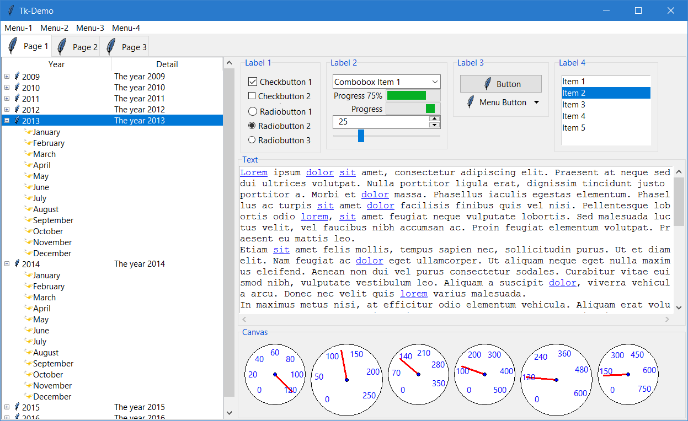
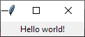
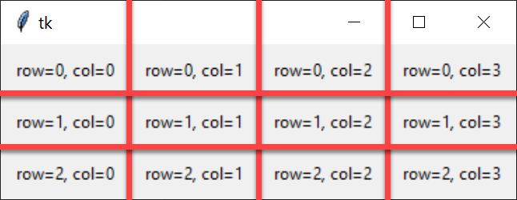

# Tkinter

[tkinter — Python interface to Tcl/Tk](https://docs.python.org/3/library/tkinter.html)

Tkinter is a Python binding to the Tk GUI toolkit and is Python's [\_de facto- standard GUI](https://wiki.python.org/moin/TkInter).

What does that mean??

**Tk** is a free, open-source, cross-platform widget toolkit for creating GUIs.

**Widgets** are the elements of a GUI - buttons, scroll bars, menus, etc.



###### [Alcotor](https://commons.wikimedia.org/w/index.php?title=User:Alcotor&action=edit&redlink) / [CC-BY-SA-4.0](https://creativecommons.org/licenses/by-sa/4.0/deed.en)

So, Tkinter is the Python library that gives us access to Tk which means we can write a GUI Python program that will run anywhere.

## Quick Overview

Let's build a simple GUI application

### Import Tkinter

You may often see demos, tutorial, and code samples that import Tkinter as follows:

```python
from tkinter import *
```

As a general rule, I prefer to import only the parts we need. For this example:

```python
from tkinter import Tk, Label
```

### The Root Widget

Tkinter manages your application's widgets in a tree (think hierarchy). This tree starts with the _root widget_, usually the main window of the application.

```python
root = Tk()
```

### Adding More Widgets

Two step process:

1. Instantiate the widget.
1. Add the widget to the root.

```python
# 1. create the label
label = Label(root, text="Hello world!")

# 2. add it to the root widget
# Here we use pack() to "shove" the label into its container. It's not very
# sophisticated or elegant, but it does the job for now.
label.pack()
```

### The event loop

Graphical programs work by setting up something commonly called _the event loop_. The event loop is simply a loop that runs in the background as long as your program is running and listens for _events_.

An _event_ in this case is any action that you take on the computer such as moving the mouse, clicking a mouse button, pressing a key on the keyboard, etc. Your graphical operating system is constantly listening for these events and passing them to the program they are intended for.

Our program needs to start its main loop.

```python
root.mainloop()
```

It's not terribly exciting now, but later we'll see how we can use the main loop to add functionality to our program.

**Note:** without the `mainloop()` our program won't appear. This is because it is not paying attention to the OS when it tells our program to display itself.

## You've Just Created a Graphical Program


Admittedly, not the most exciting one.



But there is actually a lot of functionality provided by your OS!

## Positioning Widgets Using Tkinter's Grid System

Pack is a simple way to position things, but it gives you no control over the layout.

Tkinter lets us position a widget by declaring a row and column for it to be rendered in.

```python
#! /usr/bin/env python3.8
"""Examining the Tkinter grid."""

# bring in ALL the tkinter goodies
from tkinter import Tk, Label

root = Tk()

for r in range(3):
    for c in range(4):
        label = Label(root, text=f"row={r}, col={c}", padx=10, pady=10)
        label.grid(row=r, column=c)

# set up the main loop
root.mainloop()
```



Tkinter will create the rows and columns you specify in your code.

```python
label = Label(root, text=f"row=5, col=5", padx=10, pady=10)
label.grid(row=5, column=5)
```

### Alternative Syntax (2 Steps?)

```python
for r in range(3):
    for c in range(4):
        label = Label(root, text=f"row={r}, col={c}", padx=10, pady=10).grid(row=r, column=c)
```

## Creating Buttons

`Button` class

```python
button = Button(root, text="Click Me!").pack()
```

```python
state=DISABLED
```

### Handling the `click` Event

```python
def add_label():
    """Click handler."""
    label = Label(root, text="You clicked a button!!", padx=5, pady=5)
    label.pack()

...

button = Button(root, text="Click Me!", command=add_label)
```

**Note:** the value of `command` is the _name_ of the function but is _not_ an invocation of the function

Change button (and other widget) color with `fg` and `bg`

## Tkinter Text Boxes

```python
import tkinter as tk
```

`Text` object

`get()` and `insert()` indices are floats
